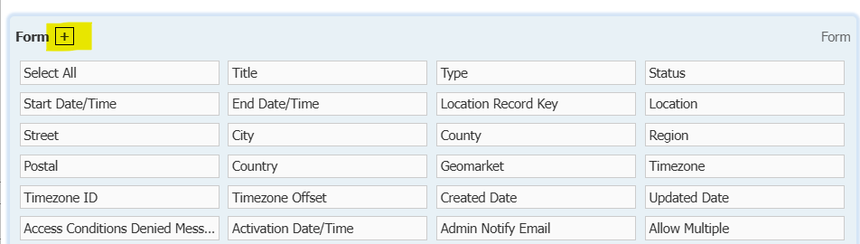
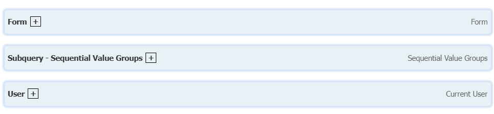

# SlateBuddy Lite

Chrome extension to add some cool stuff to Slate

This is the '"lite" public version of the Chrome extension, designed for distribution to other users.

---

## Features

The extension currently contains only 3 features (with more features and customization coming soon):

**The tab favicon is customized according to what Slate instance is open**

**The administrative banner containing the Slate instance's name has a color unique to each Slate instance**

**When selecting exports / filters in a query, each base section can be expanded and collapsed by clicking the ' + ' button next to the base name**

Expanded Section:

Collapsed Section:

---

# Changelog

### Version 0.3.3
- Changed Legacy UG instance color to be `#B5E3D8`

### Version 0.3.2
- Extension name simplified to just be "Slate Buddy"
- Colors used for each instance changed to be:
  - `#A4D65E` for **enroll.ohio.edu**
  - `#FA4616` for **admissions.ohio.edu**
  - `#00694E` for **student.ohio.edu**
  - `#AA8A00` for **grad.ohio.edu**

### Version 0.3.1

- Extension name changed to "Slate Buddy (Lite)"
- Added a changelog and more information to README

### Version 0.3.0

* Extension published on Chrome Web Store

---

## Privacy Policy

This extension is designed for personal use and runs entirely within your own web browser. It does **not** collect, store, or transmit any personal data. All changes made by this extension happen locally on your device and are limited to small modifications in how certain pages or browser features appear or behave. No information is sent to any server, and no tracking or analytics are performed.
